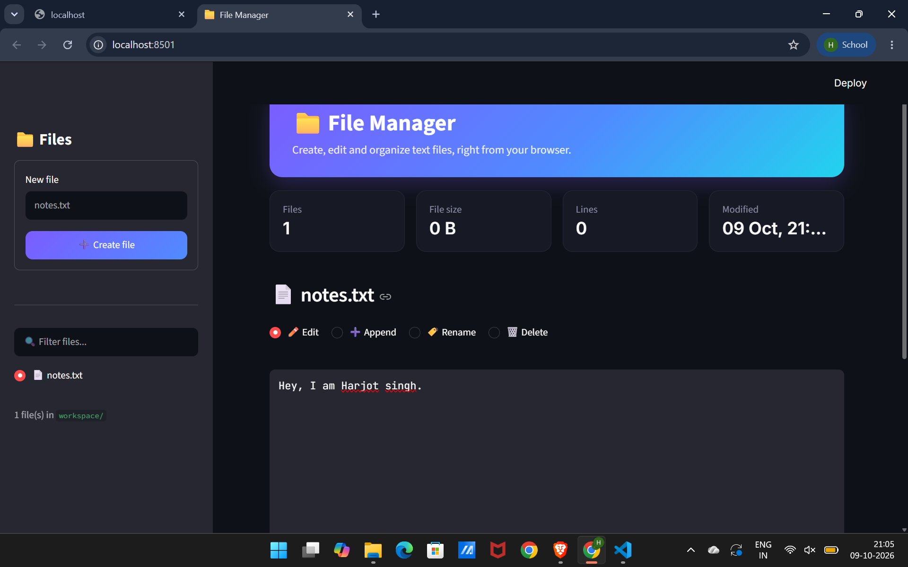

# 📁 File Manager (Python + Streamlit)

A web app for basic file handling: **create, read, edit, append, rename, download and delete** text files from a clean dark-themed browser interface.

Originally a command-line menu project, rebuilt as a Streamlit web app with input validation, confirmations and error handling.



## Features

- **Create** files from the sidebar (`.txt` is added if you give no extension)
- **Read & edit** any text file in a built-in editor, with live line and character count
- **Append** text to the end of a file
- **Rename** files safely, and **delete** them after a confirmation tick
- **Download** a file to your computer
- **Search** files instantly, with file-type icons
- **Stat cards** showing file count, size, line count and last modified time
- Safe by design: blocks invalid names and path tricks like `../x`, never overwrites an existing file, warns about unsaved changes

## Run it

Requires Python 3.9+.

```bash
git clone https://github.com/Harjotsingh1803/streamlit-file-manager.git
cd streamlit-file-manager
pip install -r requirements.txt
streamlit run app.py
```

The app opens in your browser at `http://localhost:8501`. Files are stored in a `workspace/` folder created next to `app.py`.

## Concepts demonstrated

- File I/O with `pathlib.Path` and context managers
- Building a UI with Streamlit (sidebar, tabs, forms, metrics, custom CSS and theme)
- State handling with `st.session_state` and `st.rerun()`
- Error handling (`OSError`, `UnicodeDecodeError`) and input validation

## Project structure

```
.
├── app.py
├── requirements.txt
├── README.md
├── .streamlit/
│   └── config.toml    # dark theme
└── workspace/         # created on first run
```

## Deploy (optional)

Push the repo to GitHub, then deploy it free on [Streamlit Community Cloud](https://streamlit.io/cloud). Files saved on the hosted app are not permanent: they can disappear when the app restarts.

## Author

**Harjot Singh Chawla**, B.Tech ECE, NSUT Main Campus
GitHub: [Harjotsingh1803](https://github.com/Harjotsingh1803)
